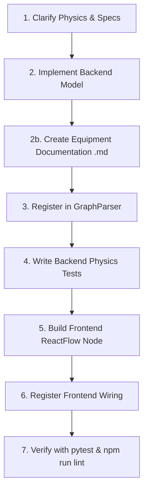

# Equipment Creation Guide for WalFlow

This skill guides you through implementing and registering a new hydraulic component in WalFlow across both the Python physics engine (**Backend**) and the ReactFlow diagram canvas (**Frontend**).

---

## 🧭 Overview & Core Principles

WalFlow is a web-based hydraulic process simulator consisting of:
* **Backend:** Python / FastAPI steady-state solver calculating algebraic equilibrium ($P, Q, T, v$).
* **Frontend:** React + ReactFlow visual drag-and-drop canvas.

### Fundamental Simulation Principles
1. **Steady-State Static Solver ($\Delta t = 0$):** All equipment equations must be static algebraic relationships. **No time-stepping, no dynamic charging/discharging ($P_1 V_1^n = P_2 V_2^n$), no time-dependent tank filling, no dynamic water hammer.**
2. **Smooth Continuity ($C^0$ and $C^1$):** Equations and derivatives must be continuously differentiable across all flow regimes to guarantee Newton-Raphson solver convergence.
3. **Analytical Jacobians:** Every equipment class should provide exact analytical derivatives ($\frac{\partial \Delta P}{\partial Q}$) for high solver speed and stability.

---

## 📋 End-to-End Development Workflow



### Step 1: Clarify Physics & Specs
Before writing code, define the component requirements:
- **Node Type ID:** Unique snake_case string (e.g. `pressure_safety_valve`, `calibrated_restriction`).
- **Archetype:** In-line resistance, flow source, boundary, dynamic closed valve (MCP), thermal unit, or multi-port junction.
- **Governing Standard:** Formal standard (e.g. ISO 5167, ISO 4126, IEC 60534, Crane TP 410).
- **Port Configuration:** Number of inlets and outlets (usually 1 inlet + 1 outlet, or multi-port like 1 in / 2 out).
- **Physical Parameters & Units:** Ensure parameters use standard engineering units in UI (bar, L/min, °C, kW) and convert to SI units (Pa, $\text{m}^3/\text{s}$, K, W) in backend.

### Step 2: Implement Backend Class
Create `backend/simulation/equipment/<name>.py` inheriting from `HydraulicNode`:
- Initialize ports via `self.add_inlet()` and `self.add_outlet()`.
- Set solver categorization flags (`is_pressure_boundary`, `is_flow_boundary`, `blocks_flow_on_shutdown`, `use_mcp_formulation`).
- Implement `calculate_delta_p(flow_rate, density, viscosity)` and `calculate_dp_derivative(flow_rate, density, viscosity)`.
- Implement `calculate()` to propagate outlet pressure, flow rate, and thermal effects ($dT = \frac{|\Delta P|}{\rho \cdot C_p}$).

📖 **Deep Dive Reference:** Read [references/backend-physics.md](file:///c:/Users/c563871/Coding/WalFlow/.agents/skills/equipment-creation/references/backend-physics.md) and [references/solver-stability.md](file:///c:/Users/c563871/Coding/WalFlow/.agents/skills/equipment-creation/references/solver-stability.md).

### Step 2b: Create Companion Documentation (`<name>.md`)
Create `backend/simulation/equipment/<name>.md` detailing:
1. Short functional overview & role.
2. Governing calculation standards (e.g., ISO, IEC, API, Crane TP 410) and model selection options.
3. Exact mathematical implementation (equations, smooth regime blending, analytical derivatives).
4. Thermal & energy balance equations.
5. Parameter and unit specification table.
6. Assumptions, boundaries, and validation benchmarks.

📖 **Deep Dive Reference:** Read [references/equipment-documentation-standard.md](file:///c:/Users/c563871/Coding/WalFlow/.agents/skills/equipment-creation/references/equipment-documentation-standard.md).


### Step 3: Register in Graph Parser
In `backend/simulation/graph_parser.py`:
1. Import the new equipment class.
2. In `GraphParser.create_node(node_data, global_settings)`, add a branch for your `node_data.type` to deserialize incoming parameters with unit conversions:
   - Pressure: $\text{bar} \times 10^5 \to \text{Pa}$
   - Flow: $\text{L/min} / 60\,000 \to \text{m}^3/\text{s}$
   - Power: $\text{kW} \times 1\,000 \to \text{W}$
   - Temperature: $^{\circ}\text{C} + 273.15 \to \text{K}$

### Step 4: Write Backend Unit & Physics Tests
Create `backend/tests/test_physics_<name>.py`:
- Test physical equations at known calibration points.
- Verify analytical derivatives against numerical central differences:
  $$\left|\frac{\partial \Delta P_{\text{analytical}}}{\partial Q} - \frac{\Delta P(Q+\delta) - \Delta P(Q-\delta)}{2\delta}\right| < \text{tol}$$
- Test full network equilibrium solve with `HydraulicNetwork` and `NewtonRaphsonSolver`.

📖 **Deep Dive Reference:** Read [references/testing-verification.md](file:///c:/Users/c563871/Coding/WalFlow/.agents/skills/equipment-creation/references/testing-verification.md).

### Step 5: Build Frontend Node Component
Create `frontend/src/nodes/<Name>Node.jsx`:
- Wrap with `<BaseNode id={id} data={data} selected={selected} width={...} height={...} footer={...}>`.
- Render SVG icon / visual symbol.
- Add `<Handle>` elements with rotation compensation (`getRotatedPosition(Position.Left, rotation)`).
- Add `<SensingPin>` for signal telemetry if applicable.

📖 **Deep Dive Reference:** Read [references/frontend-integration.md](file:///c:/Users/c563871/Coding/WalFlow/.agents/skills/equipment-creation/references/frontend-integration.md).

### Step 6: Register Frontend Wiring
Update the following frontend files:
1. `frontend/src/App.jsx`:
   - Import node and add to `nodeTypes` object.
   - Add default properties in `onDrop` handler.
2. `frontend/src/components/panels/Sidebar.jsx`:
   - Add item to appropriate category in `categorizedEquipment`.
3. `frontend/src/components/panels/SetupPanel.jsx`:
   - Add input controls for editing component properties.
4. `frontend/src/components/symbols/SymbolLibrary.jsx`:
   - Add SVG symbol rendering case under `EquipmentSymbol`.
5. *(Optional)* `frontend/src/components/details/<Name>Details.jsx` and `ResultsPanel.jsx` for dedicated live charts/telemetry.

### Step 7: Verify Everything
Run automated tests:
```bash
pytest backend/tests/test_physics_<name>.py
pytest
cd frontend && npm run lint
```

---

## 🗂️ Equipment Archetype Quick Selector

| Archetype | Examples | Key Base Flags | Reference |
| :--- | :--- | :--- | :--- |
| **Passive In-line Resistors** | Orifice, Filter, Calibrated Restriction | Defaults (`False`) | [equipment-archetypes.md#archetype-1](file:///c:/Users/c563871/Coding/WalFlow/.agents/skills/equipment-creation/references/equipment-archetypes.md) |
| **Active Flow Sources** | Centrifugal Pump, Volumetric Pump | `is_flow_boundary = True` (or $H(Q)$ curve), `blocks_flow_on_shutdown = True` | [equipment-archetypes.md#archetype-2](file:///c:/Users/c563871/Coding/WalFlow/.agents/skills/equipment-creation/references/equipment-archetypes.md) |
| **Dynamic Closed / MCP Valves** | Check Valve, Relief Valve (PSV), Rupture Disc | `use_mcp_formulation = True` | [equipment-archetypes.md#archetype-3](file:///c:/Users/c563871/Coding/WalFlow/.agents/skills/equipment-creation/references/equipment-archetypes.md) |
| **Pressure Boundaries** | Tank, Reservoir, Fixed Pressure Point | `is_pressure_boundary = True` | [equipment-archetypes.md#archetype-4](file:///c:/Users/c563871/Coding/WalFlow/.agents/skills/equipment-creation/references/equipment-archetypes.md) |
| **Multi-port Flow Junctions** | Splitter, Mixer, 3-Way TCV | Direction-aware mixing | [equipment-archetypes.md#archetype-5](file:///c:/Users/c563871/Coding/WalFlow/.agents/skills/equipment-creation/references/equipment-archetypes.md) |
| **Thermal Units** | Heat Exchanger, Cooler | Thermal duty / effectiveness | [equipment-archetypes.md#archetype-6](file:///c:/Users/c563871/Coding/WalFlow/.agents/skills/equipment-creation/references/equipment-archetypes.md) |

---

## 📚 Detailed Reference Guides

* 📐 **[backend-physics.md](file:///c:/Users/c563871/Coding/WalFlow/.agents/skills/equipment-creation/references/backend-physics.md):** Base class architecture, ports, energy balance, and fluid properties.
* 📄 **[equipment-documentation-standard.md](file:///c:/Users/c563871/Coding/WalFlow/.agents/skills/equipment-creation/references/equipment-documentation-standard.md):** Template and engineering standard citation requirements for `<equipment>.md`.
* ⚡ **[solver-stability.md](file:///c:/Users/c563871/Coding/WalFlow/.agents/skills/equipment-creation/references/solver-stability.md):** Newton solver guidelines, derivatives, MCP formulation, and topology reduction.
* 📦 **[equipment-archetypes.md](file:///c:/Users/c563871/Coding/WalFlow/.agents/skills/equipment-creation/references/equipment-archetypes.md):** Complete code templates for all 6 equipment archetypes.
* 🖥️ **[frontend-integration.md](file:///c:/Users/c563871/Coding/WalFlow/.agents/skills/equipment-creation/references/frontend-integration.md):** ReactFlow component creation, handle rotation, sidebar registration, and property editor forms.
* 🧪 **[testing-verification.md](file:///c:/Users/c563871/Coding/WalFlow/.agents/skills/equipment-creation/references/testing-verification.md):** Testing methodology, calibration validation, and derivative checks.

