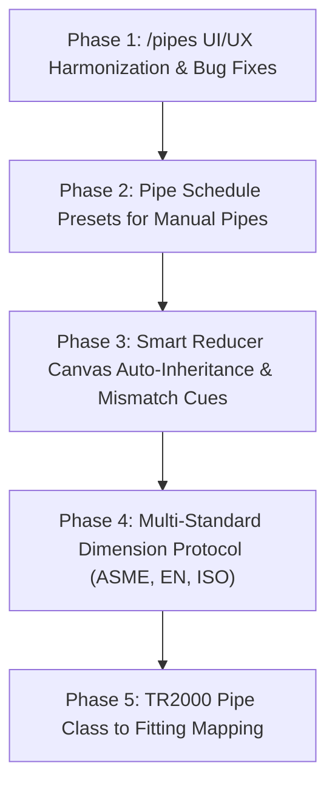

# Pipe Class and Fitting Library Improvement Log

This document records the architectural analysis, root-cause diagnostics, and proposed engineering improvements for WalFlow's **Piping Specifications (Pipe Classes)**, **Fitting Standards**, and **Pipe Schedules**.

---

## Summary of Observations

| # | Observation Summary | Area | Status |
|---|---|---|---|
| **1** | ASME B36.10M / B36.19M Schedules lack direct utilization across general pipe sizing | Pipe Schedules / Sizing | Analyzed & Planned |
| **2** | Disconnect between Pipe Classes, Reducers, and Pipe Schedules (no auto-inheritance) | Canvas & Inspector Interaction | Analyzed & Planned |
| **3** | TR2000 Reducers and Fitting standard integration to match TR2000 Pipe Classes | TR2000 / Fittings Library | Analyzed & Planned |
| **4** | Future-proofing multi-standard architecture (ASME, EN, ISO, DIN) | Standards Architecture | Analyzed & Planned |
| **5** | "Manual / Custom Dimension" lacks a Standard Schedule Sizing selector helper | Edge / Pipe Inspector | Analyzed & Planned |
| **6** | Inconsistent UI Styling & Button Nomenclature between Tabs on `/pipes` | Subpage UI/UX Compliance | Analyzed & Planned |

---

## Detailed Log Entries

---

### Observation 1: ASME B36.10M / B36.19M Pipe Schedules Direct Utilization

#### 1. Observation & User Context
The ASME B36.10M (Carbon Steel) and ASME B36.19M (Stainless Steel) Pipe Schedules catalog was added to the database and `/pipes` subpage, but it appears detached from the everyday workflow of sizing pipes on the canvas.

#### 2. Current Code Architecture & Working Principle
* **Backend Database:** Seeded in `fitting_standards` under code `ASME_B36_10M_SCHEDULES`.
* **Frontend Constants:** Mirrored in `frontend/src/constants/asme_b16_9_data.js`.
* **How it currently works:**
  * When configuring a `ReducerNode`, the schedule helper `getPipeScheduleDetails(dn, sch)` is used to look up internal diameters ($ID = OD - 2 \cdot WT$).
  * However, for **Pipes (Edges)**: When a Pipe Class (e.g. `CS01`) is selected, sizes are read exclusively from that class's own `sizes_json` array.
  * When "Manual / Custom" is selected on a pipe, the schedule matrix is not exposed at all.

#### 3. Root Cause Analysis
The schedule database was treated primarily as a lookup table for reducer wall thicknesses rather than a global **Piping Dimension Provider Service** across the entire application (Pipe Classes, Manual Edge Sizers, and Fitting Nodes).

#### 4. Proposed Improvement & Implementation Plan
1. **Promote Schedules to a Global Dimension Provider**:
   * Create a unified utility `resolveStandardPipeDimensions(standard, dn, schedule)` that serves:
     * Pipe Class creator / editor on `/pipes` (auto-populate wall thicknesses when building custom classes).
     * Canvas Edge Inspector (quick schedule picker for manual pipes).
     * Reducers, Orifices, and future fittings (Elbows, Tees).
2. **Unified Size & Schedule Resolver**: Allow any component requiring an internal diameter to resolve $OD, WT, ID$ from the standard schedules database automatically.

---

### Observation 2: Automatic Linking Between Pipe Classes, Reducers, and Schedules

#### 2. Observation & User Context
On the canvas, Reducers do not interact with connected pipes or their assigned Pipe Classes. Users must manually configure the Large End and Small End nominal sizes and schedules on the Reducer, even though the connected upstream and downstream pipes already know their pipe class and size.

#### 2. Current Code Architecture & Working Principle
* **Canvas Graph Representation:**
  * Reducer node stores its own `dn_large`, `dn_small`, `sch_large`, `sch_small` in `node.data`.
  * Connected pipes (Edges) connect to Reducer handles `inlet-0` and `outlet-0`.
  * Each edge stores its own `pipe_class` and `size_dn`.
* **How it currently works:**
  * The Reducer node renders independently and does not inspect the ReactFlow edge graph to see what line specs are attached to its ports.

#### 3. Root Cause Analysis
Node configuration on the canvas currently operates in isolation from Edge metadata. In industrial P&IDs and 3D piping design, a reducer is an in-line transition element whose inlet and outlet boundaries are physically dictated by the connecting pipe specifications.

#### 4. Proposed Improvement & Implementation Plan
1. **Upstream / Downstream Auto-Detection (Smart Inheritance)**:
   * When a Reducer is connected between two pipe edges:
     * Inspect connected Edge 1 (`inlet-0`) $\to$ Read `pipe_class`, `dn`, `sch`.
     * Inspect connected Edge 2 (`outlet-0`) $\to$ Read `pipe_class`, `dn`, `sch`.
   * Auto-populate the Reducer's $D_1$ and $D_2$ from the connected lines.
   * Display an **"Auto-Inherited from Connected Lines"** status indicator with an option to toggle to **"Manual Override"**.
2. **Orientation Intelligence**:
   * If Edge 1 is DN80 and Edge 2 is DN50, auto-set mode to **Reducing (DN80 $\to$ DN50)**.
   * If Edge 1 is DN50 and Edge 2 is DN80, auto-set mode to **Expanding (DN50 $\to$ DN80)**.
3. **Spec Alignment Validation**:
   * Display a warning badge if a reducer size doesn't match the connecting pipe diameter (e.g. "Line size mismatch: Connected pipe is DN100, Reducer inlet is DN80").

---

### Observation 3: TR2000 Fitting Integration & Matching TR2000 Pipe Classes

#### 1. Observation & User Context
Equinor TR2000 pipe classes (e.g. `L001`, `CS01`, `SS01`) specify compatible fitting standards. Can TR2000 reducer standards and fitting dimensions be matched and synchronized with TR2000 pipe classes?

#### 2. Current Code Architecture & Working Principle
* **TR2000 Service (`backend/services/tr2000_service.py`):**
  * Currently queries `/Plant/{plantId}/PCS`, `/PCS/{pcsCode}/Rev/{rev}/pipe-sizes`, and `/temp-pressures`.
  * TR2000 REST API also provides component and fitting standards (e.g., standard buttwelding reducers under EN 10253 / ASME B16.9 with Equinor TR2000 part numbers and material requisitions).
* **Fitting Catalog Database:**
  * Currently stores `FittingStandard` records with a `standard` field (`ASME`, `DIN_EN`, `TR2000`, `CUSTOM`).

#### 3. Root Cause Analysis
The TR2000 importer currently synchronizes only the base pipe dimensions ($DN, OD, WT, ID$) and P-T curves, without fetching the associated fitting specifications linked to each PCS code.

#### 4. Proposed Improvement & Implementation Plan
1. **TR2000 Fitting Mapping**:
   * Extend `tr2000_service.py` to map TR2000 PCS codes to their authorized fitting standards (e.g. TR2000 PCS `L001` $\to$ ASME B16.9 WPB carbon steel reducers, TR2000 PCS `L002` $\to$ ASTM A403 WP316L reducers, or EN 10253 equivalents).
2. **Pipe Class $\to$ Fitting Standard Association**:
   * Add a `default_fitting_standard` field (or `fittings_spec`) to the `PipeClass` model and database.
   * When a pipe class is selected on a line, any attached reducer automatically selects the compatible fitting standard defined by that pipe class.

---

### Observation 4: Multi-Standard Future Compatibility (ASME, EN, ISO, DIN)

#### 1. Observation & User Context
How can we ensure that the architecture accommodates diverse international standards (EN 10253, ISO 5251, DIN, JIS) alongside ASME without breaking existing models or requiring hardcoded rewrites?

#### 2. Current Code Architecture & Working Principle
* **Physics Solver Layer (`backend/simulation/equipment/reducer.py`):**
  * The static hydraulic solver is already standard-agnostic. It relies purely on dimensionless geometric ratios:
    $$\beta = \frac{D_{\text{small}}}{D_{\text{large}}}, \quad \theta = \text{Cone Angle (deg)}, \quad H = \text{Length (m)}$$
    $$K_{\text{form, contraction}} = 0.8 \sin\left(\frac{\theta}{2}\right)(1 - \beta^2)$$
    $$K_{\text{form, expansion}} = 2.6 \sin\left(\frac{\theta}{2}\right)(1 - \beta^2)^2$$
    $$\Delta P_{\text{Bernoulli}} = \frac{1}{2}\rho Q^2 \left(\frac{1}{A_2^2} - \frac{1}{A_1^2}\right)$$
  * Because physics depends only on dimensions ($D_1, D_2, H, \theta$), any standard in the world that provides lengths and diameters will calculate correctly in the solver.
* **Database & Schema Layer (`FittingStandard`):**
  * Stores dimensions as generic JSON:
    `[ { dn_large, dn_small, od_large_mm, od_small_mm, length_mm, cone_angle_deg, ... } ]`

#### 3. Root Cause Analysis & Areas for Standardization
While the physics engine and database are completely generic, the frontend inspector currently hardcodes ASME-specific variable names (`nps_large`, `nps_small`) and assumes ASME size combinations.

#### 4. Proposed Improvement & Implementation Plan
1. **Generic Fitting Schema Protocol**:
   * Standardize the JSON dimension schema across all standards:
     * `dn_large`, `dn_small` (Metric nominal sizes, universal).
     * `designation_large`, `designation_small` (e.g. `3"` for ASME NPS, `80` for EN/ISO DN).
     * `od_large_mm`, `od_small_mm` (Standard outer diameters).
     * `length_mm` (Face-to-face fitting length $H$).
     * `cone_angle_deg` (Conical transition angle $\theta$).
     * `standard_family` (`ASME_B16_9`, `EN_10253_2`, `ISO_5251`, `DIN_2616`).
2. **Dynamic UI Form Generation**:
   * Update `SetupPanel.jsx` and `FittingStandardsTab.jsx` to dynamically adapt column headers and labels based on the selected standard family (e.g., displaying "NPS" for ASME, and "DN (mm)" for EN/ISO).
3. **Plug-and-Play Seed Catalog**:
   * Provide pre-seeded standards for **DIN EN 10253-2** (Wrought European Steel Buttwelding Fittings) and **ISO 5251** alongside **ASME B16.9**.

---

### Observation 5: Standard Schedule Picker for Manual / Custom Piping Dimensions

#### 1. Observation & User Context
When a user sets a pipe to "Manual / Custom Dimension", the setup panel currently requires manual entry of raw millimeter numbers for inner diameter. Users want a standard selector helper (e.g., choose ASME B36.10M $\to$ DN50 / 2" $\to$ Schedule 40) that automatically populates the exact dimensions without forcing them to configure a full project pipe class.

#### 2. Current Code Architecture & Working Principle
* **Edge Inspector (`SetupPanel.jsx` lines 320–460):**
  * When `pipe_spec === 'CUSTOM'`, it renders numeric inputs for `inner_diameter` and `roughness_mm`.
  * It does not provide any standard lookup dropdowns or schedule helpers.

#### 3. Root Cause Analysis
The manual sizing mode was designed as a pure raw-number override, overlooking the common engineering need to quickly test standard nominal sizes and schedules on ad-hoc lines without saving a formal pipe specification to the database.

#### 4. Proposed Improvement & Implementation Plan
1. **Add "Standard Size Preset" Helper inside Custom Mode**:
   * Inside the Custom / Manual Pipe inspector section, add a preset selector:
     * **Preset Mode**: `[ Standard Schedule Preset | Free Manual Dimensions ]`
   * When `Standard Schedule Preset` is selected:
     * **Standard Dropdown**: `ASME B36.10M / B36.19M` (or EN / ISO).
     * **Nominal Size Dropdown**: `1/2" (DN15)` to `24" (DN600)`.
     * **Schedule Dropdown**: `STD`, `40`, `80`, `XS`, `160`.
   * Selecting a size automatically calculates and sets:
     $$ID = OD - 2 \cdot WT$$
     $$OD = 60.3\text{ mm}, \quad WT = 3.91\text{ mm} \implies ID = 52.48\text{ mm}$$
   * The user can either keep it locked to the schedule or switch to free manual mode to tweak values.
2. **Direct Visual Feedback**:
   * Show a compact dimensional summary badge: `DN50 (2") Sch 40 • OD: 60.3mm • WT: 3.91mm • ID: 52.48mm`.

### Observation 6: Inconsistent UI Styling & Button Nomenclature between Tabs on `/pipes`

#### 1. Observation & User Context
On the `/pipes` subpage:
* **Visual Disparity**: The **Piping Specifications** tab features sleek rounded card containers (`borderRadius: '12px'`), canvas background (`#F0F4F4`), active orange highlights (`rgba(250,133,7,0.08)`), segmented filter pills, and a structured grey surface header. In contrast, the **Fitting Standards & Schedules** tab uses a flat white background without cards, an extra stacked 48px sub-header, and dropdown select filters.
* **Button Nomenclature Divergence**:
  * Tab 1: `Create Examples` vs. Tab 2: `Restore Defaults` $\implies$ Standardize to **`Restore Defaults`**.
  * Tab 1: `Export Library` vs. Tab 2: `Export Fittings JSON` $\implies$ Standardize to **`Export Catalog`**.
  * Tab 1: `Import Library` vs. Tab 2: `Import Fittings JSON` $\implies$ Standardize to **`Import Catalog`**.
  * Tab 1: `+ New Pipe Class` vs. Tab 2: `+ New Standard` $\implies$ Standardize to **`+ New Fitting Standard`**.
* **CSS & WCAG Issues**:
  * `FittingStandardsTab.jsx:552`: Uses undefined `className="btn-destructive"` (renders unstyled browser button). Needs `.btn-danger-ghost`.
  * `FittingStandardsTab.jsx:394, 447, 505`: Hardcoded `#64748b` on `#FAFCFC` produces a **4.2:1** contrast ratio (fails WCAG AA 4.5:1). Needs `var(--color-text-secondary)` (`#587071` / 5.1:1).
  * Unicode glyphs (`⎘`, `✎`, `✕`) and emoji icons (`🌐`, `⚠️`, `✅`) violate `ui-ux-pro-max` SVG standard.
  * Modals in Tab 2 use raw inline fixed positioning without `.modal-overlay`, `.modal-container`, or backdrop blur.

#### 2. Proposed Improvement Plan
1. **Layout & Container Harmonization**: Remove the 48px sub-header; move top actions to the primary 56px header; wrap tables and banners in elevated white cards (`borderRadius: 12px`, `background: #FFFFFF`, `boxShadow: 0 1px 3px rgba(0,0,0,0.05)`) over `var(--color-bg-canvas)`.
2. **Sidebar Alignment**: Replace `<select>` dropdowns with segmented pill buttons: `[ All | Reducers | Schedules ]` and `[ All | ASME | EN | Custom ]`.
3. **Modal & Feedback Polish**: Refactor modals to use `.modal-overlay`, `.modal-container`, and replace blocking browser `alert()` popups with toast/modal feedback.
4. **SVG Iconography**: Replace all unicode/emojis with scalable vector SVG icons from `IconLibrary`.

---

### Observation 7: Main Canvas & Inspector UX for Piping, Reducers & DataList

#### 1. Observation & User Context
From our canvas and inspector UI/UX audit:
* **Silent Pipe-to-Reducer Mismatches**: Connecting a DN80 pipe to a DN50 reducer calculates sudden loss in physics but gives no visual indication or warning on canvas.
* **Canvas Pipe Identification**: Canvas edges only render lines and particle animations without displaying nominal size badges (e.g. `2" STD` or `DN50 - CS01`).
* **Sidebar Semantic Grouping**: Reducers are grouped under "Distribution" with splitters/mixers instead of "Piping & Fittings".
* **DataList Matrix Gaps**: Missing Schedule selector column in DataList, aggressive spec name truncation (`maxWidth: 140px`), and lack of velocity warning thresholds ($>2.5\text{ m/s}$ amber, $>4.0\text{ m/s}$ red).

#### 2. Proposed Improvement Plan
1. **Reducer Port Sizing Cues & Warning Badges**:
   * Add port diameter labels on hover/selection (`D₁: 3"`, `D₂: 2"`).
   * Cross-reference connected pipe diameter: If $|D_{\text{pipe}} - D_{\text{reducer}}| > 1\text{ mm}$, render a subtle amber warning badge (⚠️ `Inlet Mismatch: Pipe DN80 vs Reducer DN50`).
   * Add **"Auto-match from connected pipes"** action button in the inspector.
2. **Standard Schedule Quick-Preset Toolbar in Edge Inspector**:
   * Add `[STD] [SCH 40] [SCH 80] [XS]` quick-pick pills in manual mode that instantly populate $OD, WT, ID$.
3. **Sidebar Reorganization**:
   * Create dedicated **Piping & Fittings** category (*Reducer / Expander*, *Orifice*, *Calibrated Restriction*).
   * Group **Distribution & Manifolds** separately (*Splitter*, *Mixer*).
4. **DataList Polish**:
   * Add explicit **Schedule** dropdown column.
   * Apply semantic velocity highlights: Green/Normal ($\le 2.5\text{ m/s}$), Amber ($2.5 < v \le 4.0\text{ m/s}$), Red ($> 4.0\text{ m/s}$).

---

## Complete Action Plan & Implementation Roadmap

1. **Phase 1 — Subpage UI/UX Harmonization on `/pipes` (Obs 6)**:
   * Fix broken `btn-destructive` class in `FittingStandardsTab.jsx`.
   * Unify header toolbar (eliminate 48px stacked sub-header).
   * Harmonize background to `var(--color-bg-canvas)` with elevated card containers (`borderRadius: 12px`).
   * Replace dropdown filters with segmented pill buttons.
   * Standardize button nomenclature and replace unicode/emojis with SVG icons from `IconLibrary`.
   * Refactor modals to `.modal-overlay` and `.modal-container`.

2. **Phase 2 — Standard Schedule Sizing Presets for Manual Pipes (Obs 1 & 5)**:
   * Add standard schedule quick-pick toolbar (`ASME_B36_10M_SCHEDULES`) to the Pipe (Edge) Inspector.
   * Display $OD, WT, ID$, and flow area $A$ in the inspector summary card.

3. **Phase 3 — Smart Reducer Auto-Inheritance & Visual Cues (Obs 2 & 7)**:
   * Auto-detect and inherit $DN, ID$, and Schedule from connected upstream and downstream edges.
   * Add port size tags (`D₁: 3"`, `D₂: 2"`) and size mismatch warning badges (⚠️).
   * Refine Sidebar categories: **Piping & Fittings** vs. **Distribution & Manifolds**.
   * Add Schedule column and velocity warning colors in DataList.

4. **Phase 4 — Multi-Standard Family Generalization & EN/ISO Catalog (Obs 4)**:
   * Normalize fitting dimension schema for universal standard designation.
   * Add pre-seeded catalogs for **DIN EN 10253-2** and **ISO 5251**.

5. **Phase 5 — TR2000 Fitting Standard Matching (Obs 3)**:
   * Add `default_fitting_standard` relationship to `PipeClass`.
   * Auto-select authorized TR2000 fitting standards when TR2000 pipe classes are assigned.

